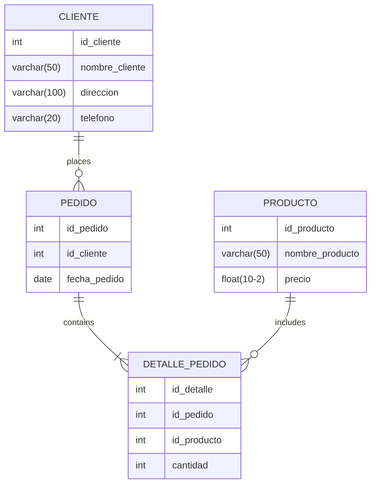

# Learning of prisma js ORM

This is a project to learn how to use prisma js ORM. This project is based on a relational database.

## Setup

This will build a up mysql service, and a node service. After, it will run the migrations and run servers of node and prisma studio.

```bash
docker-compose up 
```

## About relational database


